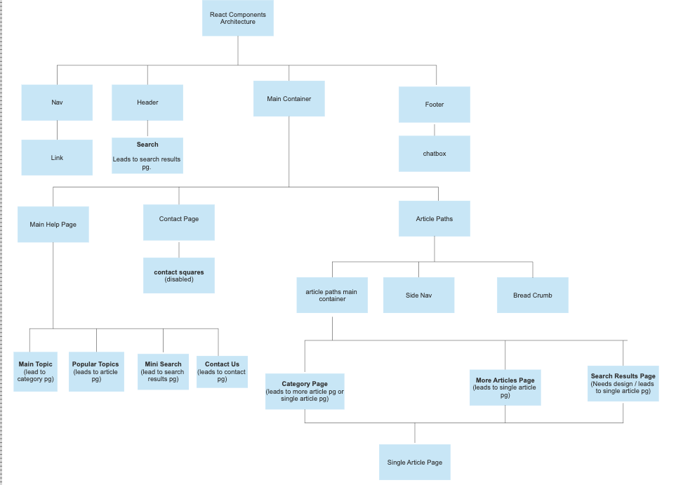

## WELCOME TO THE ASK EDD PROJECT
---------------------------

This is a front-end application serving as a mock-up of an alternative California Ask EDD page. This site addresses several concerns and frustrations of Californians experiencing unemployment during the pandemic -- hard to find answers, an overload of content, difficulty in navigating through information, and inaccessible contact information.

## WOULD YOU LIKE TO CONTRIBUTE?

If you'd like to contribute to this project, please see the [contributing guidelines](https://github.com/hannahlivnat/Ask-EDD-Project/blob/main/contributing.md).

While working on issues, the following react component architecture may be helpful in understanding the flow of components: 



## Installation
1. Clone the repo: 
```
git clone https://github.com/hannahlivnat/Ask-EDD-Project.git
```
2. Run npm install
```
npm install
```
3. Run Dev Server:

```bash
npm run dev
# or
yarn dev
```

4. Open [http://localhost:3000](http://localhost:3000) with your browser.

## Testing

[](https://dashboard.cypress.io/projects/xq3459/runs)

To Run Tests : npx cypress open

## CONTRIBUTORS
[Hannah Livnat](https://github.com/hannahlivnat) - Software Engineer, Project Leader

[Danielle Nedivi](https://www.linkedin.com/in/daniellenedivi/) - UX/UI Designer, Project Leader


